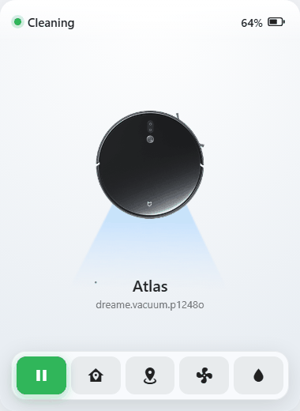
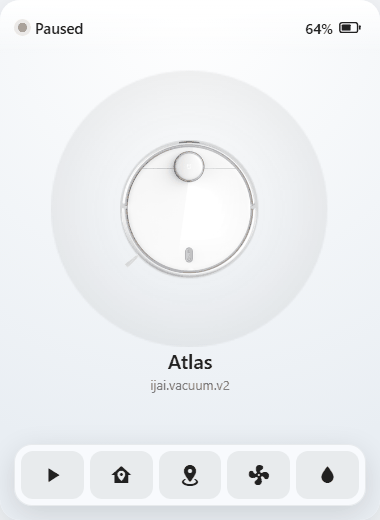
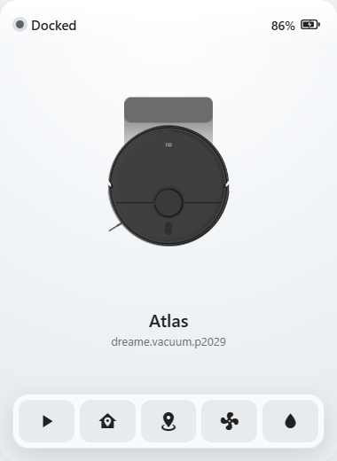
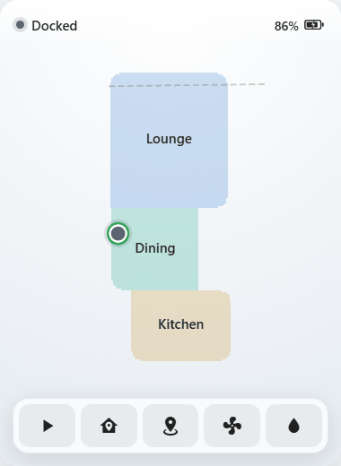

<div align="center">

# Xiaomi Vacuum for Home Assistant

**Live maps, room cleaning, and local control for supported ijai, Dreame, Viomi, and Xiaomi-labelled vacuums.**

[](https://hacs.xyz/)
[](https://github.com/letitbe-dull/xiaomi-vac/releases)
[](https://github.com/letitbe-dull/xiaomi-vac/stargazers)
[](https://github.com/letitbe-dull/xiaomi-vac/issues)
[](https://github.com/letitbe-dull/xiaomi-vac/commits)
[](https://buymeacoffee.com/letitbedull)

[Install](#installation) · [Maps](#maps) · [Card](#lovelace-card) · [Services](#services) · [Models](#supported-models) · [Contribute](#contributing)

</div>

---

## Why this exists

The official apps already have useful map data, room IDs, and device controls. This integration brings those pieces into Home Assistant, with local MIoT control after setup and optional Mi account login when you want live maps.

Use a Mi account if you want the camera, vector map data, multi-map support, and the bundled Lovelace card. Use a local token if you only want LAN control and sensors.

> [!NOTE]
> This project is not affiliated with or endorsed by Xiaomi, ijai, Dreame, Viomi, or Roidmi. It depends on reverse-engineered MIoT and Xiaomi cloud behavior, so device notes and bug reports matter.

## Maps

Maps are the main reason this integration exists.

- **Live map camera** - cloud-assisted setups fetch, decrypt, parse, and render the current vacuum map as a Home Assistant camera entity.
- **Vector map data** - the integration exposes room geometry, room labels, boundaries, cleaning path, charger position, vacuum position, walls, no-go areas, no-mop areas, zones, calibration points, and map dimensions when the decoded map includes them.
- **Tap-to-clean rooms** - select rooms in the bundled card and send them straight to `xiaomi_vac.clean_segment`.
- **Multi-map display** - devices that expose a map list can show the active map first, then stored maps that can be fetched and decoded.
- **Card-facing API** - `/api/xiaomi_vac/map/{target}` serves authenticated vector-map JSON for the bundled card and local dashboard clients.
- **Recorder-friendly camera** - large map geometry is kept out of Home Assistant history while still being available to the card and camera attributes.
- **Adaptive polling** - maps refresh faster while the vacuum is cleaning or returning, and slower while it is idle or docked.
- **Encryption support** - dreame models with encrypted cloud maps are decrypted automatically.
- **Best-effort recovery** - if a map decode fails because temporary live-key inputs are stale or missing, the coordinator rebuilds the map fetcher on the next cycle.

> [!NOTE]
> Maps are verified on ijai.v17 hardware only. For other models, map handling follows what upstream projects have proven on real hardware - but we can't test it ourselves. **If you own a Dreame, Viomi, or Xiaomi-labelled model, your feedback is the only way map support gets confirmed.** Whether it works or not, please [open an issue](https://github.com/letitbe-dull/xiaomi-vac/issues) saying your model and what you saw - a working map is as useful to hear about as a broken one.

| Cleaning | Paused | Charging | Select rooms |
|----------|--------|----------|--------------|
|  |  |  |  |

## Lovelace card

The integration includes `xiaomi-vac-card`, served from:

```text
/xiaomi-vac-card/xiaomi-vac-card.js
```

Storage-mode dashboards get the Lovelace resource automatically, with a cache-busting URL when the card JavaScript changes. YAML-mode dashboards need a manual JavaScript module resource:

```yaml
url: /xiaomi-vac-card/xiaomi-vac-card.js
type: module
```

Then add the card:

```yaml
type: custom:xiaomi-vac-card
vacuum: vacuum.xiaomi_robot_vacuum_s10
```

The card swipes between vacuum controls and available maps. It includes animated vacuum artwork, start/pause, dock, locate, fan-speed control, water-level control, map display toggles, and room selection for tap-to-clean.

> [!IMPORTANT]
> After updating the integration, hard refresh the browser tab that shows your dashboard. Restarting Home Assistant does not reload JavaScript already cached by the browser.

## Installation

### HACS

1. [Install HACS](https://www.hacs.xyz/docs/use/download/download/) if you have not already.
2. Add this repository as a custom HACS integration, or click:

   [](https://my.home-assistant.io/redirect/hacs_repository/?owner=letitbe-dull&repository=xiaomi-vac&category=integration)
3. Install **Xiaomi Vacuum**.
4. Restart Home Assistant.

### Manual

Copy `custom_components/xiaomi_vac` from this repo into `<config_dir>/custom_components/xiaomi_vac/`, then restart Home Assistant.

## Configuration

1. Go to **Settings -> Devices & Services**.
2. Click **+ ADD INTEGRATION**.
3. Search for **Xiaomi Vacuum**.
4. Choose one setup path:

| Setup path | Use it when | What you get |
|------------|-------------|--------------|
| **Mi Account** | You want maps, room cleaning from the card, and cloud-assisted discovery. | The integration signs in, discovers supported vacuums across Xiaomi regions, stores the selected vacuum IP/token/session tokens, and enables live maps. Captcha and email 2FA are handled in the flow when Xiaomi asks for them. |
| **Local token** | You want LAN control without storing Xiaomi cloud credentials. | The integration connects to the vacuum by IP address and 32-character token. Core controls and sensors are available; map rendering is skipped. |

The Mi account password is used only during login or reauthentication. It is not stored in the config entry. Older entries that still contain a saved password are migrated to remove it while keeping the existing session usable.

### Reauthentication

The integration renews cloud sessions with the saved `passToken` when it can. If Xiaomi tokens can no longer be refreshed, Home Assistant starts reauthentication and updates the existing entry in place.

### Duplicate devices

Setup uses the vacuum MAC address as the unique ID when available, so adding the same vacuum again should abort instead of creating a duplicate device.

## Entities

Entities are capability-gated by model profile. A vacuum only gets controls its model exposes.

| Entity | Type | Notes |
|--------|------|-------|
| `vacuum.<name>` | Vacuum | Cleaning, paused, idle, returning, docked, and error activity states. |
| `sensor.<name>_status` | Sensor | Home Assistant enum state. |
| `sensor.<name>_battery` | Sensor | Battery device class, percentage unit. |
| `select.<name>_fan_speed` | Select | Model-specific fan presets. |
| `select.<name>_water_level` | Select | Model-specific mop water presets. |
| `select.<name>_mode` | Select | Only when the model exposes cleaning mode control. |
| `select.<name>_sweep_type` | Select | Only when the model exposes sweep-type control. |
| `switch.<name>_repeat` | Switch | For models that support cleaning each area twice. |
| `switch.<name>_alarm` | Switch | Find-vacuum beep/alarm control when exposed by the model. |
| `number.<name>_volume` | Number | Voice volume control when exposed by the model. |
| `camera.<name>_map` | Camera | Mi account setup only. Exposes room IDs and map attributes for dashboards and automations. |

Local MIoT status polling runs every 10 seconds for responsive state, battery, and control updates. Device writes are serialized so overlapping commands do not hit the vacuum at the same time.

## Services

### `xiaomi_vac.clean_segment`

Cleans one or more specific rooms by room ID. Room IDs come from the map camera attributes and the bundled card.

| Field | Description | Example |
|-------|-------------|---------|
| `entity_id` | The vacuum entity. | `vacuum.xiaomi_robot_vacuum_s10` |
| `segments` | List of room IDs to clean. | `[10, 12]` |

Example automation:

```yaml
alias: Clean kitchen on departure
trigger:
  - platform: state
    entity_id: person.me
    to: not_home
action:
  - service: xiaomi_vac.clean_segment
    target:
      entity_id: vacuum.xiaomi_robot_vacuum_s10
    data:
      segments: [12]
```

## Supported models

These are the [67 models](SUPPORTED-MODELS.md) onboardable today. If yours misbehaves or is missing, please open an issue with the exact model string and what did or did not work.

| Brand | Models |
|-------|--------|
| **ijai** | v1, v2, v3, v13, v14, v15, v17, v18, v19 |
| **Xiaomi** | b106bk/eu, c101/eu, c103, c104, d106gl, ov21gl, ov71gl |
| **Viomi** | v12, v13, v15, v17, v18, v19, v22, v23, v24, v35, v38, v40, v45 |
| **Dreame** | p2008, p2009, p2027/28/28a/29/36, p2114a/o, p2140/a/p, p2148o, p2149o, p2150a/b/o, p2157, p2187, p2259, r2104, r2205, r2209, r2210, r2211o, r2215, r2216o, r2228/o/z, r2232a, r2233, r2235, r2246, r2247, r2254 |

Not sure of your model string? Check the device label, the Mi Home app device info screen, or Home Assistant's device registry after a local-token setup attempt.

Dreame's only stop-family action is spec-labelled "Pause" — its HA stop and pause buttons both pause the clean rather than stopping outright.

## Debugging

Add this to `configuration.yaml`, then restart Home Assistant:

```yaml
logger:
  default: info
  logs:
    custom_components.xiaomi_vac: debug
```

When opening an issue, include the model string, setup path, Home Assistant version, relevant debug logs, and whether the problem affects control, map fetch, map rendering, the card, or a specific entity.

## Contributing

Help is especially useful from people with different vacuum models. The integration supports several families, and the awkward bugs usually live in the differences between devices.

Useful contributions include:

- Testing setup, local control, maps, card controls, and room cleaning on a specific model.
- Posting notes for devices that work, partly work, or fail to onboard.
- Sharing map behavior details: whether room labels appear, whether stored maps load, whether no-go/no-mop areas render, and whether tap-to-clean sends the right rooms.
- Reporting profile mismatches, missing fan or water presets, incorrect activity states, or unsupported controls that should not appear.
- Sending pull requests for fixes, model profiles, docs, and test coverage.

Open an [issue](https://github.com/letitbe-dull/xiaomi-vac/issues) with device notes, or send a pull request if you already know the fix. Logs are useful, but please remove tokens, cookies, account identifiers, and any private map details before posting.

---

<div align="center">
<sub>Not affiliated with or endorsed by Xiaomi, ijai, Dreame, Viomi, or Roidmi. Use at your own risk.</sub>
</div>
